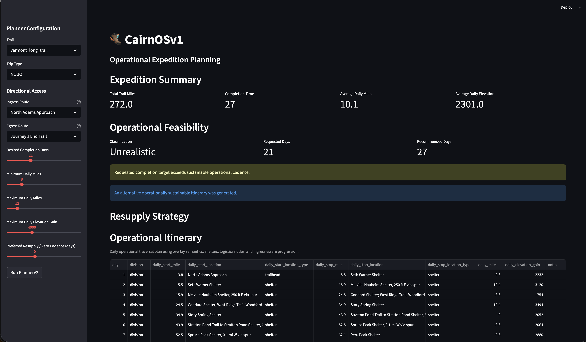
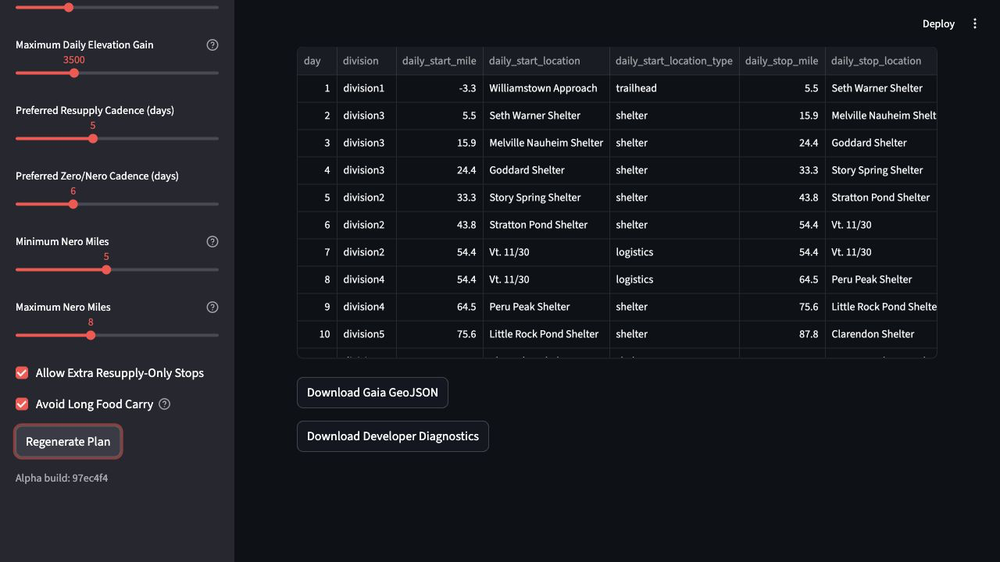

# CairnOSv1

CairnOSv1 is an operational expedition planning system for long-distance trail networks. It is designed to move beyond abstract mileage partitioning and toward realistic, logistics-aware itinerary synthesis using trail-level operational semantics.

## Product positioning

CairnOSv1 is the operational reasoning layer for expedition planning, not a
replacement for mature map, navigation, or guidebook tools. It complements
workflows in tools such as HiiKER, Gaia GPS, Garmin, FarOut, and paper maps by
generating logistics-aware itineraries that can be reviewed, adjusted, and
exported into navigation systems.

The project should stay focused on questions like:

- Is this itinerary feasible for the requested mileage, elevation, and recovery
  preferences?
- Where do shelter, camp, resupply, zero, and nero decisions make operational
  sense?
- Which days exceed the user's stated comfort zone?
- What export can downstream navigation tools consume?

CairnOSv1 should not try to become a general-purpose route drawing, offline
navigation, social trail database, or map subscription platform.

## Screenshots

The current Streamlit workflow supports planner configuration, generated
expedition summaries, resupply strategy output, operational itinerary review,
and Gaia GeoJSON export.





## Hosted Alpha

CairnOSv1 is preparing for a low-friction hosted Alpha on Streamlit Community
Cloud for a small trusted tester group. The hosted app is an advisory prototype,
not a safety-critical trip-planning authority. Users must verify routes,
services, conditions, closures, and backcountry decisions with official sources
before hiking.

Alpha testing guidance lives in `docs/ALPHA_TESTING.md`.

The hosted Streamlit runtime should use the app-specific dependency file at:

```text
cairn/interfaces/requirements.txt
```

The hosted app needs compiled runtime data and a small set of runtime CSV
inputs, not the full topology compiler or raw GIS dataset. Required runtime
data is currently:

- `trails/vermont_long_trail/compiled/`
- `trails/vermont_long_trail/raw/csv/approach_trails.csv`
- `trails/vermont_long_trail/raw/csv/route_master.csv`
- `trails/vermont_long_trail/raw/csv/resupply_amenities.csv`

The topology compiler, raw SHP/DEM inputs, raw enrichment exports, and
build-time GIS dependencies are development assets and should not be treated as
hosted Alpha runtime requirements.

## What it does today

- Builds a trail topology and operational graph from compiled trail data.
- Loads route overlay metadata and operational node semantics at runtime.
- Synthesizes expedition itineraries through the `PlannerV2` facade, with
  terrain, logistics, and itinerary responsibilities split into focused helper
  modules under `cairn/planner/`.
- Supports THRU trip planning with separate trip type and direction controls.
  SECTION planning is deferred and hidden in the UI for the MVP.
- Preserves NOBO and SOBO ingress/egress semantics over northbound-reference guidebook miles.
- Prioritizes real shelter and campsite stops over synthetic labels, including
  compiled overnight reference candidates.
- Separates resupply cadence from zero/nero recovery cadence.
- Adds resupply-aware itinerary annotations from operational logistics nodes and curated Long Trail town-access data.
- Produces a resupply strategy table with trip-start carry segment, town access,
  access-distance context, and days to next resupply and recovery.
- Uses terrain interval analysis to bias daily pacing and report terrain-derived
  elevation gain for selected legs.
- Exports PlannerV2 itineraries as Gaia-compatible GeoJSON with daily stops, planned resupply road crossings, shelter/campsite markers, and the trail spine.
- Includes a Streamlit UI scaffold in `cairn/interfaces/streamlit_app.py` for operational presentation.
- Provides tests in `cairn/tests/` for planner behavior, operational stop
  selection, SOBO direction semantics, Streamlit UI controls, Gaia export
  behavior, and reference enrichment.

## What it is working toward

CairnOSv1 is evolving toward:

- overlay-authoritative itinerary synthesis
- cadence-aware daily planning
- fatigue and recovery modeling
- realistic logistics and resupply reasoning
- operational traversal continuity across approach/egress branches
- terrain-aware expedition planning instead of pure geometry slicing
- an expedition-grade workspace for guided trail planning and review

The near-term MVP roadmap is tracked in `docs/MVP_ROADMAP.md`.

## Project structure

- `build_topo/` — topology compiler and operational graph generation
- `cairn/runtime/` — runtime graph loading, traversal semantics, operational queries
- `cairn/planner/` — `PlannerV2` facade plus terrain, logistics, and itinerary helper modules
- `cairn/interfaces/` — UI and interface surfaces (Streamlit)
- `data/` — forward-looking raw/derived/manual/generated data separation structure
- `docs/` — documentation assets and provenance/licensing notes
- `trails/vermont_long_trail/` — sample trail dataset and compiled outputs
- `cairn/tests/` — automated tests for planner and runtime behavior

## Streamlit UI

The Streamlit app provides a user-facing interface for requesting expedition plans and viewing the planner's response.

Typical input parameters include:

- trip type selection (THRU for MVP; SECTION is deferred)
- direction selection (NOBO / SOBO)
- ingress / egress approaches
- daily cadence or target mileage preferences
- operational constraints such as shelter/campsite preferences
- preferred resupply cadence
- preferred zero/nero recovery cadence
- configurable minimum and maximum nero mileage
- optional extra resupply-only stops

The output includes:

- a synthesized daily itinerary
- descriptive stop names and operational locations
- average daily mileage calculated over moving days, excluding zero-mile
  recovery rows
- terrain-derived daily elevation gain where compiled terrain coverage exists,
  reported directly rather than capped to the elevation preference
- a resupply strategy table tied to real road crossings, trailheads, and town-access points
- days until the next resupply segment or finish
- operational feasibility warnings when the requested timeline is achievable
  only by exceeding daily mileage or elevation preferences
- Gaia GeoJSON download with a hot-pink trail spine, lime shelter/campsite markers, and red car markers for planned resupply crossings
- alternate realistic plans when the requested itinerary is infeasible
- validation feedback when a user request is invalid or cannot be satisfied as requested
- persistent generated results until the user explicitly regenerates the plan

The screenshots above show the current Streamlit workflow: planner configuration, resupply strategy output, the operational itinerary table, and the Gaia GeoJSON export action.

## Gaia export

The Gaia export layer lives in `cairn/export/gaia_geojson.py`.

It converts a PlannerV2 operational itinerary into a Gaia-importable GeoJSON feature collection:

- one Point feature for each daily stop
- one Point feature for each planned resupply crossing selected by the resupply strategy
- one LineString feature for the compiled trail spine
- marker metadata for Gaia imports:
  - shelters: `gaia-shelter`, lime green
  - campsites: `gaia-campsite`, lime green
  - resupply road crossings: `gaia-car`, red
  - trail spine: hot pink

Daily stop coordinates are resolved from compiled and enriched trail data, preferring curated reference coordinates where available and falling back to compiled route overlay or spine interpolation. Planned resupply markers are driven by `resupply_amenities.csv`, which now includes latitude and longitude for the known Long Trail resupply access points.

## Resupply and recovery semantics

PlannerV2 treats resupply cadence as a food-carry planning target and zero/nero cadence as a separate recovery planning target. Both are soft windows, not fixed intervals. Resupply notes are added only when the itinerary crosses an operationally meaningful logistics/access node, while zero and nero notes are reserved for recovery stops.

Nero annotations are constrained by a configurable mileage window. The default
window is 5-8 miles, and the Streamlit UI exposes minimum and maximum nero-mile
controls so recovery semantics can match the user's planning style.

The resupply strategy table includes the trip start as the first carry segment
anchor, then lists planned resupply access points, parsed town access distance,
access notes, days until the next resupply segment or finish, and days until
the next recovery stop. Terminal-day resupply stops are suppressed because they
do not reduce a future food carry.

The current Long Trail resupply layer is sourced from:

- `trails/vermont_long_trail/raw/csv/resupply_amenities.csv`
- `trails/vermont_long_trail/compiled/route_overlay.json`

The raw CSV preserves town access, available services, zero-day suitability, source provenance, and road/trailhead coordinates. The planner still relies on route overlay semantics for operational truth; the CSV enriches access points with practical resupply metadata.

## Terrain-aware pacing

PlannerV2 now uses compiled terrain samples to evaluate the actual start/stop
interval for each moving day. The planner computes direction-aware gain, loss,
gain per mile, and ruggedness, then uses those values to bias upcoming daily
mileage lower in harder sections and higher in gentler sections.

Planner and export outputs use northbound-reference guidebook miles. The dense
compiled terrain profile currently uses an internal geometry/sample mile domain,
so PlannerV2 maps guidebook mainline miles into that terrain domain explicitly
before reading elevation samples.

When dense compiled terrain coverage cannot resolve an interval, the planner
falls back to `route_master.csv` elevation points and then to a conservative
distance-based estimate. This keeps ingress/egress and incomplete terrain
coverage operational without reintroducing capped elevation output.

Elevation calculations apply a small vertical-noise threshold before summing
gain and loss. This keeps dense DEM/profile samples closer to route-planning
tools that smooth small elevation reversals instead of counting every tiny
sample fluctuation.

Operational feasibility classification now treats small, sparse preference
overages as minor exceptions instead of automatically escalating a reasonable
plan to aggressive. Larger or repeated mileage/elevation exceptions still raise
the classification.

## Elevation calibration

Local reference exports from tools such as Gaia GPS or Garmin Explore can be
placed in:

```text
elevation_calibration/
```

That directory is intentionally ignored by git except for its README. Use it for
local comparison inputs only; do not commit third-party route exports,
screenshots, or proprietary map data without provenance review.

Run a local comparison report with:

```bash
venv/bin/python -m cairn.runtime.elevation_calibration elevation_calibration/*.geojson
```

The report compares reference distance/gain/loss against Cairn terrain
intervals where the interval can be inferred from the route title, such as
`LongTrailCenterlineTrackRouteNOBO` or `NorthAdamsApproachNOBO`.

## Gaia reference enrichment

Optional Gaia-exported waypoint data can be stored at:

```text
trails/vermont_long_trail/raw/geojson/gaia_reference.geojson
```

The standalone compiler stub:

```text
build_topo/compiler/gaia_reference_overlay.py
```

parses Point features into:

```text
trails/vermont_long_trail/compiled/waypoint_reference.json
```

This enrichment layer preserves Gaia waypoint names, coordinates, icons, marker types, and marker colors. It is used by the Gaia export layer to improve shelter/campsite placement and marker metadata, but it is not operational truth and is not wired into PlannerV2 traversal behavior.

## Overnight reference enrichment

Optional shelter and campsite GeoJSON exports can be stored at:

```text
trails/vermont_long_trail/raw/geojson/shelters.geojson
trails/vermont_long_trail/raw/geojson/campsites.geojson
```

The overnight reference compiler:

```text
build_topo/compiler/overnight_reference.py
```

produces:

```text
trails/vermont_long_trail/compiled/overnight_reference.json
```

This layer matches shelter/campsite waypoints against `route_overlay.json`,
keeps matched and unmatched records, estimates trail miles from the compiled
spine for unmatched points, and exposes near-spine planner candidates as
additional shelter/camp stop options. It enriches overnight stop selection but
does not mutate `route_overlay.json` or replace overlay operational truth.

## Data handling

- Project code is licensed under Apache 2.0, but datasets may have separate
  licenses and obligations.
- Compiled outputs are stored under `trails/vermont_long_trail/compiled/` and `trails/vermont_long_trail/intermediate/`.
- Curated resupply access metadata is stored in `trails/vermont_long_trail/raw/csv/resupply_amenities.csv`.
- Optional Gaia reference waypoint data is stored in `trails/vermont_long_trail/raw/geojson/gaia_reference.geojson`.
- Optional overnight shelter/campsite reference exports are stored in
  `trails/vermont_long_trail/raw/geojson/`.
- New data work should use the `data/` layout:
  - `data/raw/` for untouched source data
  - `data/derived/` for transformed datasets
  - `data/manual/` for manually curated Cairn datasets
  - `data/generated/` for reports, exports, cache files, and temporary outputs
- Raw DEM files are managed outside normal Git history using Git LFS to avoid repository bloat.
- `.gitattributes` already tracks `trails/vermont_long_trail/raw/dem/*.tif` with Git LFS.
- Dataset provenance is tracked in `data/DATASETS.md`; guidance lives in `docs/DATA_PROVENANCE.md`.
- Readme images and documentation assets are kept under `docs/images/` to avoid top-level directory pollution.

## Getting started

1. Install dependencies:

```bash
python -m pip install -r requirements.txt
```

1. Run the test suite:

```bash
python -m pytest cairn/tests -q
```

1. Launch the Streamlit interface (if desired):

```bash
streamlit run cairn/interfaces/streamlit_app.py
```

For hosted Alpha deployments on Streamlit Community Cloud, use
`cairn/interfaces/streamlit_app.py` as the app entrypoint and configure the
feedback form URL as a Streamlit secret named `alpha_feedback_url`.

## Notes for developers

- `PlannerV2` is the authoritative current planner facade.
- Terrain, logistics/recovery, and itinerary synthesis logic should stay in
  `cairn/planner/terrain.py`, `cairn/planner/logistics.py`, and
  `cairn/planner/itinerary.py` unless a public facade method is needed for
  compatibility.
- The system intentionally avoids synthetic planner behavior in favor of operational realism.
- The overlay (`route_overlay.json`) is the authoritative source for canonical stop names, shelter semantics, and progression ordering.
- NOBO and SOBO use the same northbound-reference guidebook miles; direction changes traversal order, not mile semantics.
- Terrain and spine geometry miles must not be treated as public planner miles
  unless an explicit mapper reconciles them to guidebook miles.
- Selected ingress and egress routes are planner state, not display-only metadata.
- Resupply behavior should stay tied to real logistics/access nodes and curated access data, not arbitrary day numbers.
- Recovery behavior should remain separate from resupply behavior even when both occur at the same access point.
- Gaia reference data is enrichment only; do not treat Gaia waypoint exports as planner traversal authority.
- Overnight reference data can add planner stop candidates only after matching,
  spine-distance checks, and provenance review.
- Existing code still reads trail datasets from `trails/`; do not move those files without compatibility shims and tests.
- The build pipeline is responsible for generating terrain and operational graph artifacts, not the planner itself.
- Hosted Alpha deployments should rely on compiled runtime artifacts and the
  small raw CSV files listed in `docs/ALPHA_TESTING.md`, not the full
  build/topology source dataset.
- SECTION planning is intentionally hidden from the Streamlit menu for the MVP
  while the internal code path remains available for future work.
- See `docs/MVP_ROADMAP.md` before starting data quality, mile-system,
  traversal, or SECTION planning work.

## License

CairnOSv1 project code is licensed under the Apache License 2.0. See `LICENSE`.

Data files are not automatically Apache licensed. Trail datasets, OSM-derived
layers, Gaia exports, DEMs, screenshots, generated reports, and manually
curated data may carry separate provenance and license obligations. See
`docs/DATA_PROVENANCE.md` and `data/DATASETS.md` before reusing datasets.

## Current repository goals

- Keep expedition planning semantics operationally realistic.
- Preserve approach/egress semantics and negative-mileage ingress paths.
- Avoid pushing large raw terrain files into normal git history.
- Build toward a production-ready expedition modeling toolchain.
