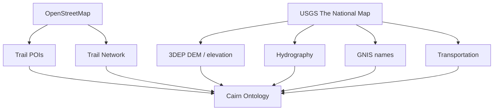

# Issue 70: TNM + OSM Trail Data Ingestion

GitHub issue: https://github.com/ecorbett135/CairnOSv1/issues/70

## Decision Summary

The USGS National Map should not replace OpenStreetMap as Cairn's trail-data source, but it should become a strong second source for authoritative terrain, hydrography, transportation, and named-place data.

For Cairn, the useful split is:

- OpenStreetMap: trail POIs, hiker-maintained features, informal trail metadata, and community-maintained trail-adjacent infrastructure.
- USGS The National Map: authoritative elevation, hydrography, GNIS names, transportation layers, boundaries, and government-maintained geospatial products.

This keeps Cairn aligned with an ontology-first trail-data refinery rather than a one-off Long Trail dataset collection process.

## Why Not topoBuilder First

topoBuilder is useful for rendered map products, but The National Map Download Client and TNM Access API are more interesting for Cairn because they expose the underlying GIS datasets. Cairn needs machine-readable trail, elevation, hydrography, name, and crossing inputs more than it needs rendered map sheets.

## Source Roles

### OpenStreetMap Strengths

OSM should remain the primary source for hiker-maintained trail POIs and practical trail context:

- Shelters
- Privies
- Campsites
- Trailheads
- Road crossings
- Parking lots
- Water sources
- Guideposts and informal hiking metadata

Candidate OSM tags for Long Trail ingestion include:

- `amenity=shelter`
- `tourism=alpine_hut`
- `highway=trailhead`
- `information=guidepost`
- `tourism=camp_site`
- `amenity=parking` or parking-related variants

### USGS National Map Strengths

The National Map should be used where Cairn needs authoritative or repeatable geospatial products:

- 3DEP elevation and DEM-derived terrain products
- Hydrography
- GNIS place names
- Transportation layers
- Government-maintained trail datasets
- Boundaries and structures where useful for corridor context

For new work, treat 3D Hydrography Program data as the forward-looking hydrography direction and treat National Hydrography Dataset references as legacy unless a target workflow still depends on them.

## Target Architecture



## Long Trail Starting Point

For the Vermont Long Trail, the first automated TNM pass should download or resolve:

- Transportation
- Hydrography
- GNIS
- 3DEP DEM or elevation products

The parallel OSM pass should extract shelter, campsite, parking, trailhead, guidepost, and other hiking-adjacent POIs.

## Derived Cairn Products

Once Cairn has trail geometry plus DEM plus hydrography plus OSM POIs, the ingestion pipeline can derive products that are currently hard to source consistently:

- Water crossings
- Water proximity
- Road crossings
- Summit and named-place context
- Elevation profiles
- Grade profiles
- Corridor-aware POI matching

These products should feed the existing Cairn CSV and JSON planning contracts rather than becoming app-specific logic.

## Proposed Future Command

```bash
cairn ingest long-trail
```

The future workflow should:

1. Download or refresh OSM trail and POI data.
2. Download or refresh USGS TNM products through TNM Access where supported.
3. Clip source datasets to the trail corridor.
4. Normalize features into the Cairn ontology.
5. Generate trail planning artifacts:
   - `route_master.csv`
   - `shelters.csv`
   - `water.csv`
   - `crossings.csv`
   - `peaks.csv`
   - `elevation_profile.csv`

## MVP Boundary

This is not an MVP dependency for HikerLogix field use. It belongs on the CairnOS roadmap as a design and future ingestion capability. The MVP path can continue using current curated Long Trail data while this design matures.

## Open Questions

- Which OSM extract source should Cairn standardize on for repeatable trail-corridor imports?
- Which TNM product ids are required for the Long Trail corridor, and which are optional?
- What corridor buffer should be used for clipping and POI matching?
- How should Cairn handle conflicts between OSM and USGS feature positions or names?
- Should authoritative USGS names override OSM names, or should Cairn preserve both with source attribution?
- What minimum provenance fields are required for every generated record?

## References

- USGS The National Map Download Client: https://apps.nationalmap.gov/downloader/
- USGS TNM Access API: https://tnmaccess.nationalmap.gov/api/v1/docs
- USGS The National Map Data Delivery: https://www.usgs.gov/programs/national-geospatial-program/national-map
- USGS 3D Elevation Program: https://www.usgs.gov/3d-elevation-program
- USGS 3D Hydrography Program: https://www.usgs.gov/3d-hydrography-program
