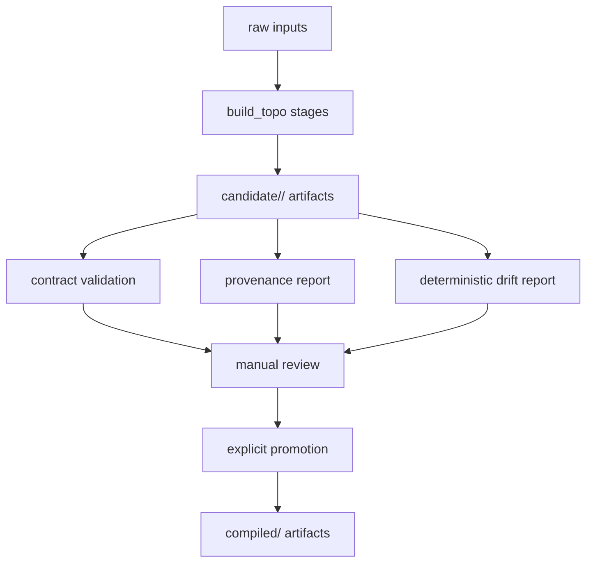

# Issue 74: build_topo Modernization

GitHub issue: https://github.com/ecorbett135/CairnOSv1/issues/74

## Decision Summary

`build_topo` should become the repeatable trail data refinery for CairnOS. The
long-term direction is a workflow such as:

```bash
cairn ingest long-trail
```

That future workflow should normalize OSM trail POIs and hiking metadata plus
USGS TNM/TNMAccess terrain, hydrography, GNIS names, and transportation data
into Cairn planning artifacts.

The first buildable modernization slice must be smaller and safer. It should
make the current compiler trustworthy before adding external download
automation. This means tightening stage contracts, provenance, validation, and
artifact boundaries while preserving the currently promoted Long Trail compiled
files.

## Relationship To Issue 70

Issue #70 defines the source roles:

- OSM: trail POIs, hiker-maintained features, informal hiking metadata, and
  community-maintained trail-adjacent infrastructure.
- USGS TNM/TNMAccess: elevation, hydrography, GNIS names, transportation
  layers, boundaries, and other authoritative geospatial products.
- topoBuilder: optional human-readable topo output or QA artifact, not the
  primary ingestion source.

Issue #74 turns that source architecture into a compiler modernization plan.
It does not start by downloading OSM or TNM data. It starts by making
`build_topo` able to prove what it reads, what it writes, and whether generated
candidate artifacts are safe to promote.

## Current Compiler Role

`build_topo` already has the right broad shape. It owns:

- topology compilation
- terrain segmentation
- operational overlay generation
- logistics node generation
- crossings generation
- approach trail integration
- graph substrate generation
- schema registry generation
- validation

Its key promoted outputs currently live under:

```text
trails/<trail>/compiled/
```

Those files remain the trusted planning substrate until a generated candidate
set is explicitly verified and promoted.

## First Slice Scope

The first modernization slice should deliver:

1. Explicit stage contracts for the existing compiler stages.
2. Clear generated artifact classes and output boundaries.
3. Provenance metadata for generated candidates.
4. Validation that can run against candidate output without modifying promoted
   compiled artifacts.
5. A manual promotion model for replacing promoted artifacts only after review.

This slice should not:

- add OSM download automation
- add TNM/TNMAccess download automation
- overwrite `trails/<trail>/compiled/` by default
- regenerate or replace current Long Trail compiled files
- expose or implement SECTION planning
- treat topoBuilder as an ingestion input

## Artifact Boundaries

The trail data directories should distinguish trusted promoted artifacts from
generated candidates.

```text
trails/<trail>/
  raw/          # source inputs, curated or externally obtained
  intermediate/ # existing or future transient compiler products
  candidate/   # generated candidate artifact sets, never trusted by default
  compiled/    # promoted artifacts used by runtime and planner
```

Candidate output should use run-specific directories:

```text
trails/<trail>/candidate/<run_id>/
```

Example:

```text
trails/vermont_long_trail/candidate/2026-06-03-build-topo-contracts/
```

`compiled/` remains the only promoted location. Candidate artifacts may be
compared against `compiled/`, but they must not replace compiled artifacts
without the explicit `promote_candidate.py` step.

## Candidate Data Flow



## Stage Contract Shape

Each compiler stage should have a documented contract:

- stage name
- stage module
- required inputs
- generated outputs
- output schema or shape
- provenance requirements
- validation rules
- whether the stage is deterministic
- whether the stage is allowed to use external network access

For the first slice, network access should be false for every stage. External
source acquisition belongs to a later ingestion slice.

Candidate metadata should capture enough detail to reproduce and review a run:

- trail id
- run id
- git commit
- command arguments
- stage list and stage order
- input paths and content hashes where practical
- output paths and content hashes where practical
- validation result
- validation timestamp
- known warnings

Candidate drift review is deterministic. The review command reads
`candidate_report.json` and, when available, `container_candidate_plan.json`.
It prints artifact drift and optional baseline/candidate smoke endpoint drift,
and writes `candidate_drift_report.json` only inside the candidate directory
when explicitly requested. It must not write to `compiled/` or decide whether a
trail update is valid.

AI-assisted drift investigation belongs to a later advisory layer. It can use
the deterministic drift report to search for recent closure, reroute, shelter,
or facility-change evidence, but it should not replace deterministic checks or
perform promotion.

Future AI drift review should consume:

- previous build topology
- current build topology
- normalized drift list
- known expected drift rules
- project and app metadata
- optional web evidence with source URLs and retrieval dates

The agent job is to classify each drift as expected, likely expected,
suspicious, or unknown/needs review. The review must explain why, cite the
local fact or web source supporting the claim, call out weak evidence, and
suggest rule updates without applying them automatically.

## Validation Model

Validation should answer three questions before promotion:

1. Did every expected candidate artifact get produced?
2. Does each candidate artifact satisfy its schema or contract?
3. Did the candidate materially change promoted output in a way that requires
   human review?

The first slice can start with lightweight validation:

- required file presence
- JSON parseability
- GeoJSON shape checks where practical
- required keys and field types
- no writes to `compiled/` during candidate generation
- candidate run manifest exists and names every produced artifact

Diff-aware validation can mature later:

- route mile count changes
- overnight node count changes
- crossing count changes
- geometry delta thresholds
- candidate versus promoted artifact summaries

## Promotion Model

Promotion should be explicit and reviewable. The deterministic promotion
command is:

```bash
python3 build_topo/scripts/promote_candidate.py \
    trails/vermont_long_trail/candidate/<run_id> \
    --accept-drift
```

Promotion requirements should include:

- candidate validation passes
- candidate report exists
- deterministic drift report exists
- summary drift is reviewed
- current promoted artifacts are preserved or recoverable
- generated files are promoted and committed intentionally

The command snapshots current promoted artifacts under
`trails/<trail>/promotion_snapshots/<promotion_id>/`, copies only
candidate-present artifacts into `compiled/`, and writes
`candidate_promotion_report.json` inside the candidate directory. It never
deletes promoted files in this slice. If a candidate is missing an artifact
that exists in `compiled/`, the promoted artifact stays in place and the
promotion report records the skip.

## Interaction With Runtime And Planner

`cairn/runtime` and planner code should continue reading promoted compiled
artifacts only. They should not read candidate files unless a future validation
or preview workflow explicitly opts in.

This keeps field-facing behavior stable while `build_topo` matures.

## Interaction With SECTION Planning

SECTION planning remains downstream of this work. Modernized `build_topo`
should eventually provide the route overlay, approach/egress, mile-system,
crossing, terrain, and operational graph substrate that SECTION planning needs.

This issue should not implement SECTION semantics. It should make future
SECTION semantics less fragile by improving the data substrate first.

## Testing Strategy

The first implementation plan should add focused tests that prove boundaries
and contracts without changing current compiled data:

- contract tests for stage declarations
- validation tests using small temporary candidate directories
- tests that candidate generation paths do not write to `compiled/`
- manifest/provenance shape tests
- schema registry or JSON key checks for existing generated artifact types

Full compiler integration tests can remain narrow. The goal is to prove the
new boundary before trusting regenerated trail data.

## Acceptance Criteria

- A design-level stage contract exists for the current `build_topo` stages.
- Candidate artifact output is defined as
  `trails/<trail>/candidate/<run_id>/`.
- Promoted artifacts remain under `trails/<trail>/compiled/`.
- The first buildable slice does not add OSM or TNM download automation.
- The first buildable slice does not overwrite compiled Long Trail artifacts.
- Validation can run against candidate output before promotion.
- The promotion model is explicit: accepted candidate artifacts are copied into
  `compiled/` only through a guarded command that preserves a recoverable
  snapshot first.
- SECTION planning is deferred until the topology compiler can reliably produce
  the substrate it needs.

## Open Questions For Implementation Planning

- Should stage contracts live in Python declarations, YAML/JSON metadata, or a
  generated schema registry extension?
- Should candidate run ids be timestamp-based, user-provided, or both?
- Should validation produce one combined report or per-stage reports?
- Which existing generated artifacts should get schema checks first?
- Should temporary test candidates live under pytest temp directories only, or
  should there be checked-in fixtures under `tests/fixtures/`?
- Should artifact promotion eventually support explicit deletions, or should
  missing candidate artifacts always remain no-op skips?
